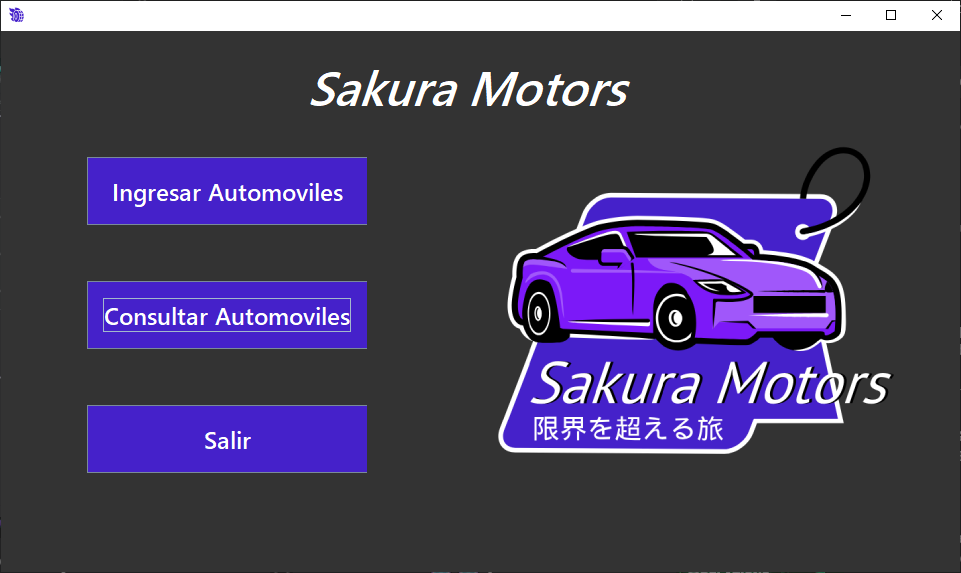
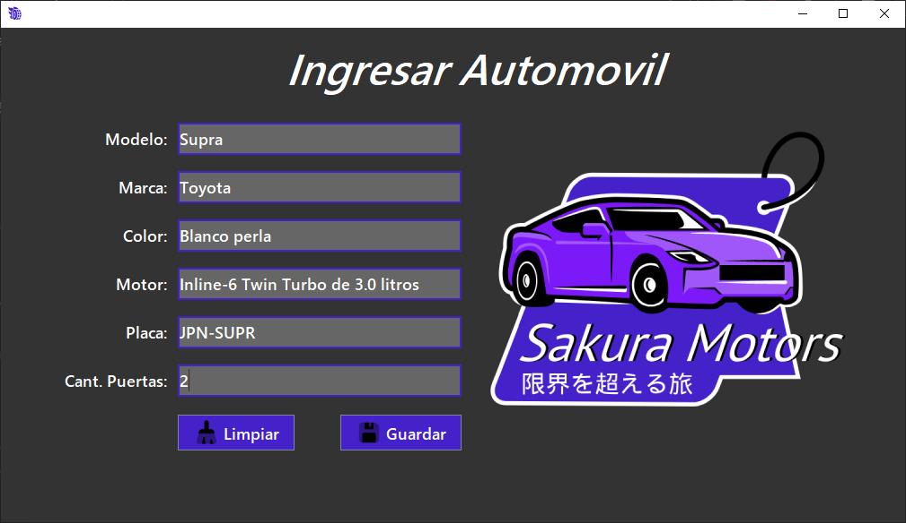
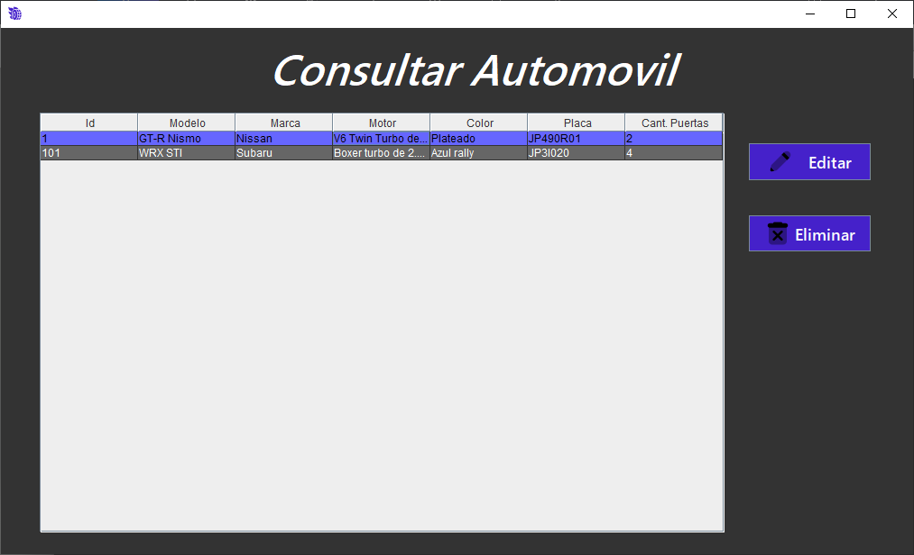
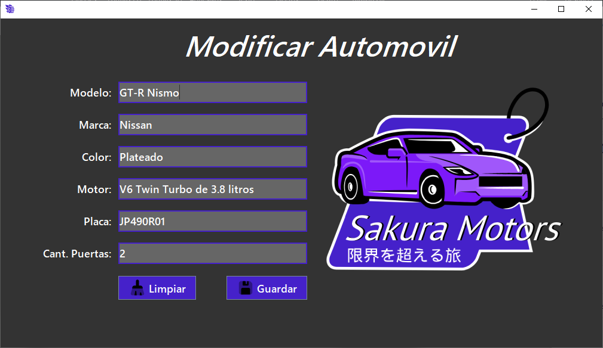

# Concesionaria de Autos **Sakura Motors**

- Aplicación de escritorio con funcionalidad CRUD (Crear, Leer, Actualizar, Eliminar).
- Diseñada para gestionar los automoviles disponibles en la concesionaria.
- Interfaz intuitiva para ingresar, visualizar, actualizar y eliminar registros de autos.
- Permite manejar información detallada de los vehiculos.
- Desarrollada con Java y Swing para una experiencia eficiente y fácil de usar.
- Utiliza JPA para la persistencia de datos.

**Si deseas ver otra versión: [Peluquería de Mascotas](https://github.com/LJossue/Peluqueria_Mascotas)**

## Capturas

> Menú del sistema

> Cargar datos

> Consultar datos

> Editar datos
